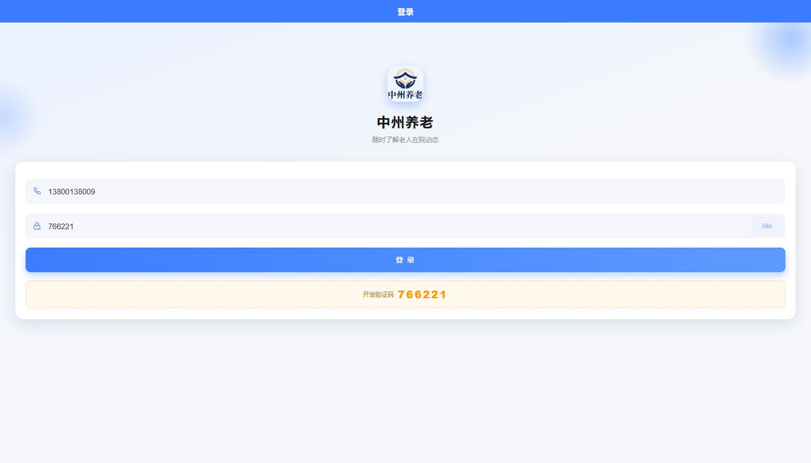
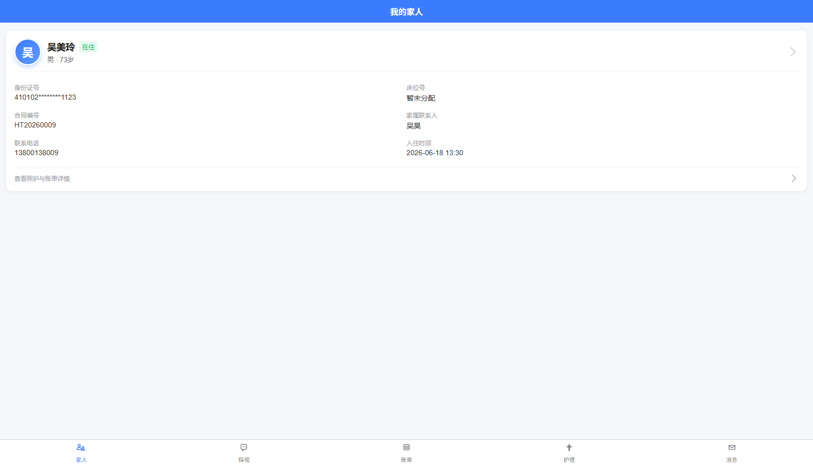
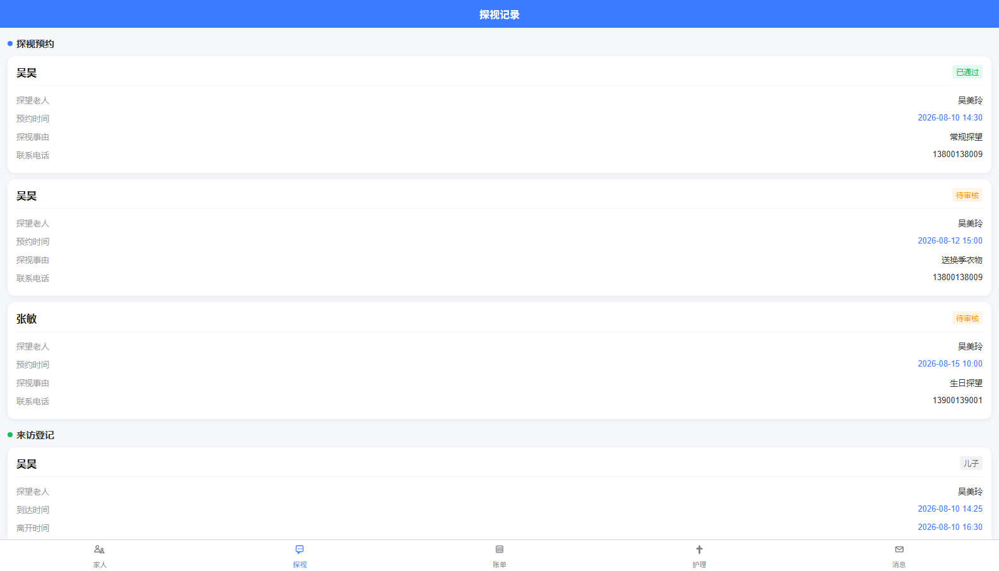
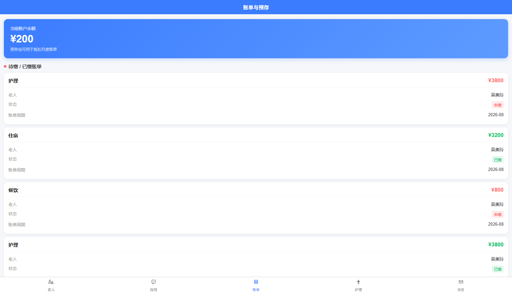
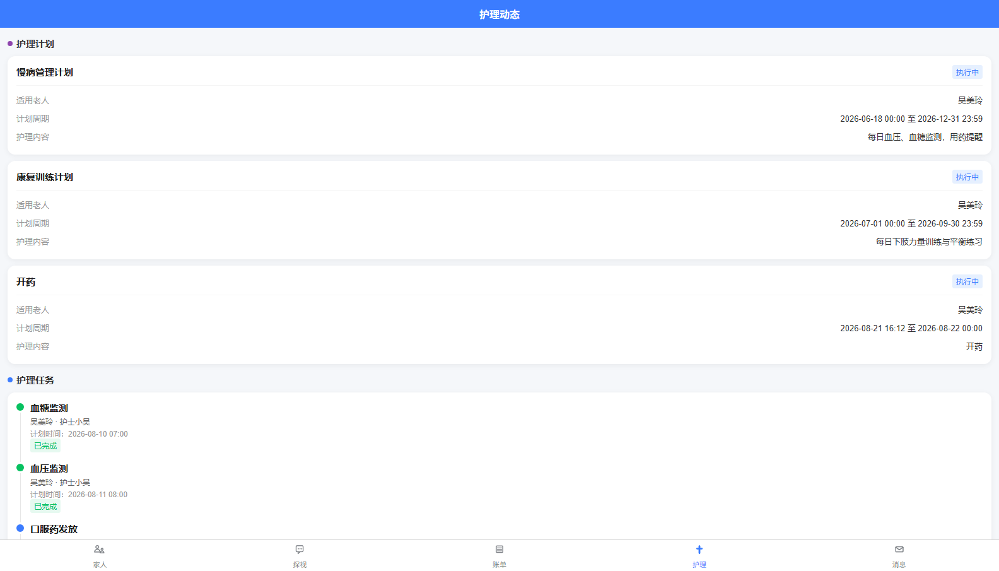
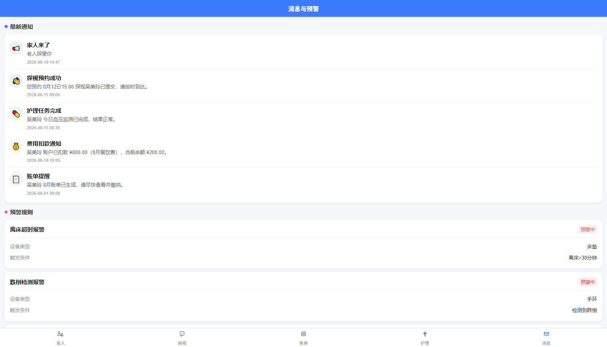

# 中州养老 · 家属端

面向养老机构老人家属的移动端应用，覆盖老人信息查看、探视预约、账单预存、护理动态、消息预警五大场景。基于 **uni-app + Vue3 + Vite** 实现一套代码同时编译为**微信小程序**与 **H5**。

## 技术栈

- [uni-app](https://uniapp.dcloud.net.cn/)（Vue 3 + Vite）跨端框架
- [uview-plus](https://uiadmin.net/uview-plus/) 移动端 UI 组件库
- SCSS / CSS 变量设计系统
- 微信小程序原生能力：componentPlaceholder 用时注入、lazyCodeLoading 按需加载

## 功能预览

### 登录页



支持手机号 + 短信验证码登录；开发环境下后端会返回 `devCode`，页面自动展示，方便前后端联调。

### 我的家人



展示在住老人信息卡片，身份证等敏感信息已做脱敏处理，状态标签（在住/出院）实时映射。

### 探视记录



查看历史探视预约与来访登记，状态包含已通过、待审核等。

### 账单与预存



展示账户余额、待缴 / 已缴账单明细，支持按护理、住宿、餐饮等费用类型查看。

### 护理动态



查看护理计划、护理任务执行记录及完成状态。

### 消息与预警



接收机构通知、探视预约结果、护理任务完成、费用扣款等消息，并展示离床超时、跌倒检测等设备预警规则。

## 快速开始

```bash
# 安装依赖
npm install

# 运行 H5 开发服务器
npm run dev:h5

# 运行微信小程序开发版
npm run dev:mp-weixin
```

H5 开发服务器默认地址：`http://localhost:5173/`

## 项目目录

```
src/
  api/           # 接口请求封装
  components/    # 全局公共组件
  pages/         # 业务页面
  static/        # 静态资源与全局样式
  utils/         # 工具函数与网络请求
  App.vue
  main.js
  manifest.json  # 小程序/H5 应用配置
  pages.json     # 页面路由与 tabBar 配置
```

## 主要技术点

- **跨端开发**：一套 Vue3 代码通过 uni-app 编译为微信小程序与 H5。
- **统一请求层**：Promise 化 `uni.request`，自动注入 Token、统一响应解析、401 跳转登录、全局错误提示。
- **多端差异处理**：H5 通过 Vite Proxy 代理 `/api` 解决开发跨域，小程序端直连后端。
- **敏感信息脱敏**：身份证号等隐私数据前端展示时自动掩码。
- **状态枚举映射**：后端数字枚举转前端文案与颜色标签，展示层与逻辑层解耦。
- **小程序性能优化**：使用 `componentPlaceholder` 用时注入低频自定义组件，降低首屏渲染压力。
- **自动化图标生成**：通过 Python PIL 脚本批量生成 tabBar 双色图标，保证多分辨率下边缘平滑。
